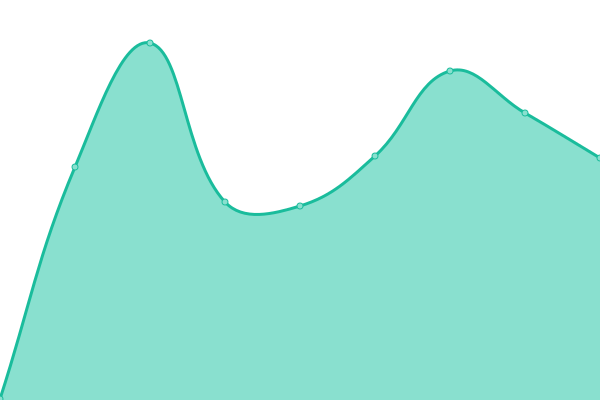
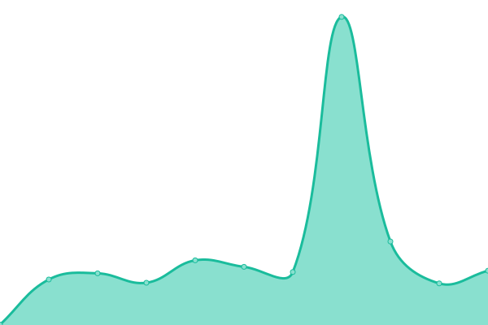
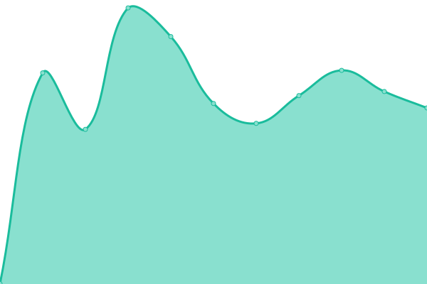
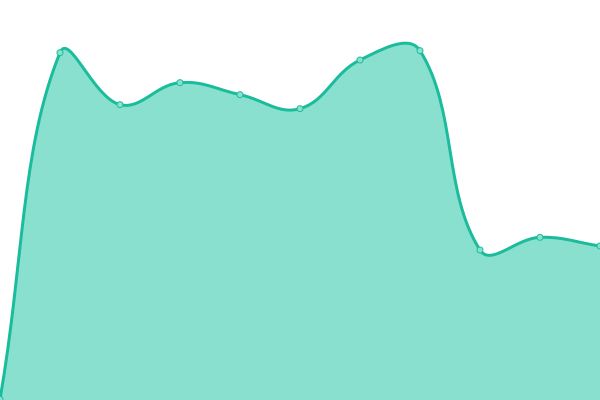
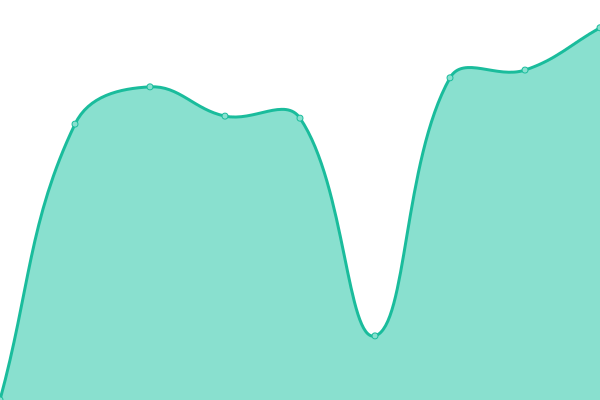
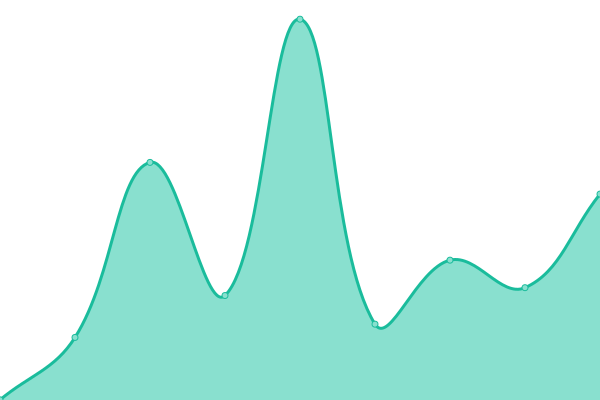
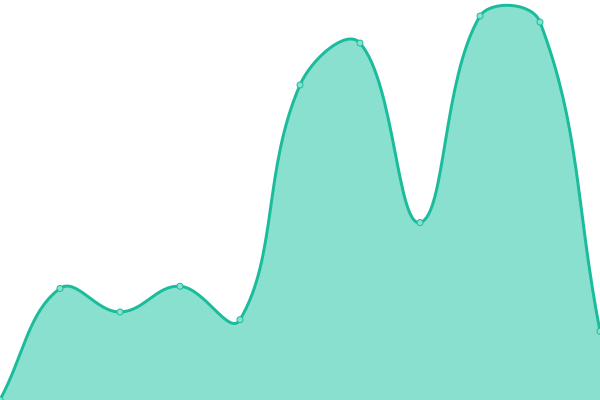

# [📈 Live Status](https://status.mswd.io): <!--live status--> **🟩 All systems operational**

This repository contains the open-source uptime monitor and status page for [Upptime](https://upptime.js.org), powered by [Upptime](https://github.com/upptime/upptime).

With [Upptime](https://upptime.js.org), you can get your own unlimited and free uptime monitor and status page, powered entirely by a GitHub repository. We use [Issues](https://github.com/upptime/upptime/issues) as incident reports, [Actions](https://github.com/upptime/upptime/actions) as uptime monitors, and [Pages](https://upptime.github.io/upptime) for the status page.

<!--start: status pages-->
<!-- This summary is generated by Upptime (https://github.com/upptime/upptime) -->
<!-- Do not edit this manually, your changes will be overwritten -->

| URL                                             | Status | History                                                                                                     | Response Time                                                                          | Uptime                                                                                                                                                                                                                     |
| ----------------------------------------------- | ------ | ----------------------------------------------------------------------------------------------------------- | -------------------------------------------------------------------------------------- | -------------------------------------------------------------------------------------------------------------------------------------------------------------------------------------------------------------------------- |
| [YourFleece](https://yourfleece.com)            | 🟩 Up  | [your-fleece.yml](https://github.com/shamoon/mswd-upptime/commits/master/history/your-fleece.yml)           |  703ms       |            |
| [Kalon Studios](https://kalonstudios.com)       | 🟩 Up  | [kalon-studios.yml](https://github.com/shamoon/mswd-upptime/commits/master/history/kalon-studios.yml)       |  207ms     |        |
| [CoreEM](https://coreem.net)                    | 🟩 Up  | [core-em.yml](https://github.com/shamoon/mswd-upptime/commits/master/history/core-em.yml)                   |  551ms           |                    |
| [FemInEM](https://feminem.org)                  | 🟩 Up  | [fem-in-em.yml](https://github.com/shamoon/mswd-upptime/commits/master/history/fem-in-em.yml)               |  600ms         |                |
| [NYIAC](https://nyiac.org)                      | 🟩 Up  | [nyiac.yml](https://github.com/shamoon/mswd-upptime/commits/master/history/nyiac.yml)                       |  1338ms            |                        |
| [LAC+USC EM](https://lacuscem.com)              | 🟩 Up  | [lac-usc-em.yml](https://github.com/shamoon/mswd-upptime/commits/master/history/lac-usc-em.yml)             |  419ms        |              |
| [SFP](https://sidefourproject.com)              | 🟩 Up  | [sfp.yml](https://github.com/shamoon/mswd-upptime/commits/master/history/sfp.yml)                           |  3845ms              |                            |
| [BN/SEM](https://socialem.net)                  | 🟩 Up  | [bn-sem.yml](https://github.com/shamoon/mswd-upptime/commits/master/history/bn-sem.yml)                     |  1880ms           |                      |
| [Giantmecha](https://giantmecha.com)            | 🟩 Up  | [giantmecha.yml](https://github.com/shamoon/mswd-upptime/commits/master/history/giantmecha.yml)             |  893ms        |              |
| [A Chjana](https://achjana.com)                 | 🟩 Up  | [a-chjana.yml](https://github.com/shamoon/mswd-upptime/commits/master/history/a-chjana.yml)                 |  916ms          |                  |
| [A Ciambra](https://aciambra.com)               | 🟩 Up  | [a-ciambra.yml](https://github.com/shamoon/mswd-upptime/commits/master/history/a-ciambra.yml)               |  1400ms        |                |
| [Stress Positions](https://stresspositions.com) | 🟩 Up  | [stress-positions.yml](https://github.com/shamoon/mswd-upptime/commits/master/history/stress-positions.yml) |  1193ms |  |

<!--end: status pages-->

[**Visit our status website →**](https://status.mswd.io)

## 📄 License

- Code: [MIT](./LICENSE) © [Upptime](https://upptime.js.org)
- Data in the `./history` directory: [Open Database License](https://opendatacommons.org/licenses/odbl/1-0/)
