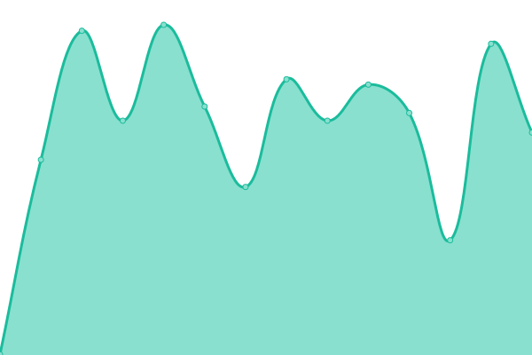

# [📈 Live Status](https://status.mswd.io): <!--live status--> **🟧 Partial outage**

This repository contains the open-source uptime monitor and status page for [Upptime](https://upptime.js.org), powered by [Upptime](https://github.com/upptime/upptime).

With [Upptime](https://upptime.js.org), you can get your own unlimited and free uptime monitor and status page, powered entirely by a GitHub repository. We use [Issues](https://github.com/upptime/upptime/issues) as incident reports, [Actions](https://github.com/mswd-io/upptime/actions) as uptime monitors, and [Pages](https://upptime.github.io/upptime) for the status page.

<!--start: status pages-->
<!-- This summary is generated by Upptime (https://github.com/upptime/upptime) -->
<!-- Do not edit this manually, your changes will be overwritten -->
<!-- prettier-ignore -->
| URL | Status | History | Response Time | Uptime |
| --- | ------ | ------- | ------------- | ------ |
|  [YourFleece](https://yourfleece.com) | 🟥 Down | [your-fleece.yml](https://github.com/mswd-io/upptime/commits/HEAD/history/your-fleece.yml) | 

 188ms
     
 | 

<a href="https://status.mswd.io/history/your-fleece">97.09%</a>
    

|  [YourCotton](https://cottonfabric.com) | 🟥 Down | [your-cotton.yml](https://github.com/mswd-io/upptime/commits/HEAD/history/your-cotton.yml) | 

 184ms
     
 | 

<a href="https://status.mswd.io/history/your-cotton">97.08%</a>
    

|  [Kalon Studios](https://kalonstudios.com) | 🟩 Up | [kalon-studios.yml](https://github.com/mswd-io/upptime/commits/HEAD/history/kalon-studios.yml) | 

 382ms
     
 | 

<a href="https://status.mswd.io/history/kalon-studios">100.00%</a>
    

|  [CoreEM](https://coreem.net) | 🟩 Up | [core-em.yml](https://github.com/mswd-io/upptime/commits/HEAD/history/core-em.yml) | 

 294ms
     
 | 

<a href="https://status.mswd.io/history/core-em">100.00%</a>
    

|  [LAG+USC EM](https://laguscem.com) | 🟥 Down | [lag-usc-em.yml](https://github.com/mswd-io/upptime/commits/HEAD/history/lag-usc-em.yml) | 

 318ms
     
 | 

<a href="https://status.mswd.io/history/lag-usc-em">97.08%</a>
    

|  [Giantmecha](https://giantmecha.com) | 🟩 Up | [giantmecha.yml](https://github.com/mswd-io/upptime/commits/HEAD/history/giantmecha.yml) | 

 492ms
     
 | 

<a href="https://status.mswd.io/history/giantmecha">100.00%</a>
    

|  [Stress Positions](https://stresspositions.com) | 🟩 Up | [stress-positions.yml](https://github.com/mswd-io/upptime/commits/HEAD/history/stress-positions.yml) | 

 1344ms
     
 | 

<a href="https://status.mswd.io/history/stress-positions">100.00%</a>
    

<!--end: status pages-->

[**Visit our status website →**](https://status.mswd.io)

## 📄 License

- Code: [MIT](./LICENSE) © [Upptime](https://upptime.js.org)
- Data in the `./history` directory: [Open Database License](https://opendatacommons.org/licenses/odbl/1-0/)
