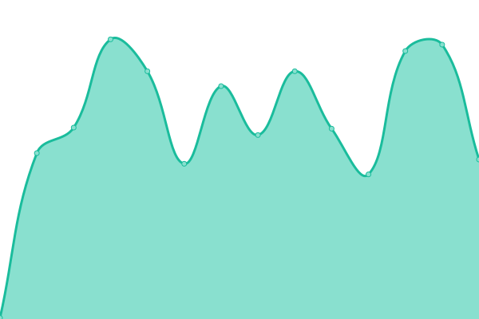

# [📈 Live Status](https://status.mswd.io): <!--live status--> **🟩 All systems operational**

This repository contains the open-source uptime monitor and status page for [Upptime](https://upptime.js.org), powered by [Upptime](https://github.com/upptime/upptime).

With [Upptime](https://upptime.js.org), you can get your own unlimited and free uptime monitor and status page, powered entirely by a GitHub repository. We use [Issues](https://github.com/upptime/upptime/issues) as incident reports, [Actions](https://github.com/upptime/upptime/actions) as uptime monitors, and [Pages](https://upptime.github.io/upptime) for the status page.

<!--start: status pages-->
<!-- This summary is generated by Upptime (https://github.com/upptime/upptime) -->
<!-- Do not edit this manually, your changes will be overwritten -->
<!-- prettier-ignore -->
| URL | Status | History | Response Time | Uptime |
| --- | ------ | ------- | ------------- | ------ |
|  [YourFleece](https://yourfleece.com) | 🟩 Up | [your-fleece.yml](https://github.com/mswd-io/upptime/commits/HEAD/history/your-fleece.yml) | 

 271ms
     
 | 

<a href="https://status.mswd.io/history/your-fleece">100.00%</a>
    

|  [Kalon Studios](https://kalonstudios.com) | 🟩 Up | [kalon-studios.yml](https://github.com/mswd-io/upptime/commits/HEAD/history/kalon-studios.yml) | 

 251ms
     
 | 

<a href="https://status.mswd.io/history/kalon-studios">100.00%</a>
    

|  [CoreEM](https://coreem.net) | 🟩 Up | [core-em.yml](https://github.com/mswd-io/upptime/commits/HEAD/history/core-em.yml) | 

 720ms
     
 | 

<a href="https://status.mswd.io/history/core-em">100.00%</a>
    

|  [FemInEM](https://feminem.org) | 🟩 Up | [fem-in-em.yml](https://github.com/mswd-io/upptime/commits/HEAD/history/fem-in-em.yml) | 

 811ms
     
 | 

<a href="https://status.mswd.io/history/fem-in-em">100.00%</a>
    

|  [NYIAC](https://nyiac.org) | 🟩 Up | [nyiac.yml](https://github.com/mswd-io/upptime/commits/HEAD/history/nyiac.yml) | 

 1491ms
     
 | 

<a href="https://status.mswd.io/history/nyiac">100.00%</a>
    

|  [LAC+USC EM](https://lacuscem.com) | 🟩 Up | [lac-usc-em.yml](https://github.com/mswd-io/upptime/commits/HEAD/history/lac-usc-em.yml) | 

 481ms
     
 | 

<a href="https://status.mswd.io/history/lac-usc-em">100.00%</a>
    

|  [SFP](https://sidefourproject.com) | 🟩 Up | [sfp.yml](https://github.com/mswd-io/upptime/commits/HEAD/history/sfp.yml) | 

 3922ms
     
 | 

<a href="https://status.mswd.io/history/sfp">100.00%</a>
    

|  [BN/SEM](https://socialem.net) | 🟩 Up | [bn-sem.yml](https://github.com/mswd-io/upptime/commits/HEAD/history/bn-sem.yml) | 

 2781ms
     
 | 

<a href="https://status.mswd.io/history/bn-sem">100.00%</a>
    

|  [Giantmecha](https://giantmecha.com) | 🟩 Up | [giantmecha.yml](https://github.com/mswd-io/upptime/commits/HEAD/history/giantmecha.yml) | 

 834ms
     
 | 

<a href="https://status.mswd.io/history/giantmecha">100.00%</a>
    

|  [A Chjana](https://achjana.com) | 🟩 Up | [a-chjana.yml](https://github.com/mswd-io/upptime/commits/HEAD/history/a-chjana.yml) | 

 2322ms
     
 | 

<a href="https://status.mswd.io/history/a-chjana">99.69%</a>
    

|  [A Ciambra](https://aciambra.com) | 🟩 Up | [a-ciambra.yml](https://github.com/mswd-io/upptime/commits/HEAD/history/a-ciambra.yml) | 

 3192ms
     
 | 

<a href="https://status.mswd.io/history/a-ciambra">99.93%</a>
    

|  [Stress Positions](https://stresspositions.com) | 🟩 Up | [stress-positions.yml](https://github.com/mswd-io/upptime/commits/HEAD/history/stress-positions.yml) | 

 2301ms
     
 | 

<a href="https://status.mswd.io/history/stress-positions">100.00%</a>
    

<!--end: status pages-->

[**Visit our status website →**](https://status.mswd.io)

## 📄 License

- Code: [MIT](./LICENSE) © [Upptime](https://upptime.js.org)
- Data in the `./history` directory: [Open Database License](https://opendatacommons.org/licenses/odbl/1-0/)
